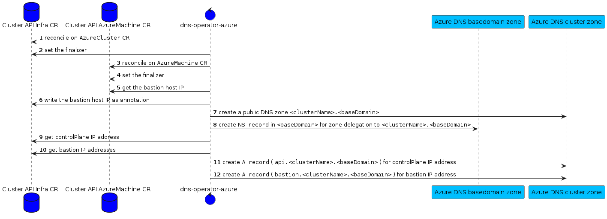

 

# dns-operator-azure

`dns-operator-azure` is a controller, which runs once per management Cluster. It's responsible for creating one DNS zones per `cluster` and additional DNS records per `AzureCluster`:

* `NS`: `<clustername>` in DNS zone `<baseDomain>`
* `A`: `api` in DNS zone `<clustername>` in `AzureCluster` resource group. This record points to the kubernetes API IP of a `cluster`

> the TTL is set to 1h. This might change in the future or will became configurable.

## reconciliation loop

This is a simplified version of the reconciliation loop:

## finalizer

The operator set the finalizer `dns-operator-azure.finalizers.giantswarm.io` on the `AzureCluster` CR.

## cluster deletion

On `Cluster` deletion, `CAPZ` deletes the entire `resourceGroup` where the `<clustername>` specific DNS zone exists as well. For that reason on deletion only the `NS` record in the `<baseDomain>` must be handled by the operator.

## configuration

`dns-operator-azure` expect an existing DNS Zone which is used as `baseDomain` (e.g. `kubernetes.my-company.io`).
There is no need to have this DNS Zone in the same subscription where `dns-operator-azure` is running.

To act on this DNS Zone, the name and the resource group must be defined by `-base-domain` and `-base-domain-resource-group` flag.
The subscription where this DNS Zone exist must be defined by setting the `AZURE_SUBSCRIPTION_ID` environment variable.

### Azure AuthN/AuthZ

To make `dns-operator-azure` work on the `baseDomain` DNS Zone you have to create an application in `Azure ActiveDirectory`. This application need the `DNS Zone Contributor` role applied for to the `baseDomain` DNS Zone.

The application secrets must be defined by setting the `AZURE_CLIENT_ID`, `AZURE_TENANT_ID` and `AZURE_CLIENT_SECRET` environment variables.

To make `dns-operator-azure` work on the `clustername` DNS zone it's only required that the Kubernetes `serviceAccount` is able to get the referenced `AzureClusterIdentity` from the `AzureCluster`. With these information the `dns-operator-azure` creates an internal Azure client to interact with the cluster specific Azure resources.
